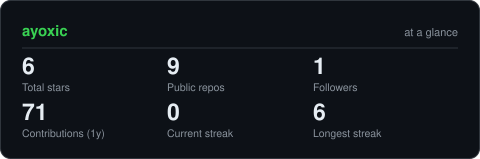
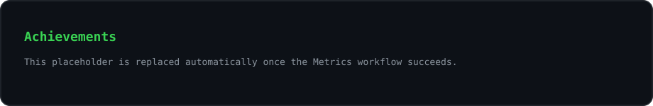
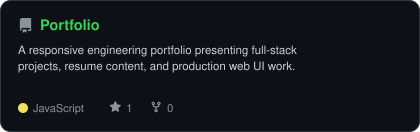
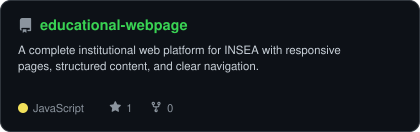
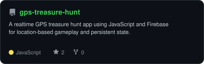
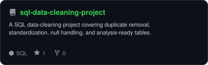

<div align="center">

<!-- PORTRAIT - generated into assets/portrait.svg by scripts/dotify.py. -->


<br>

<a href="https://github.com/ayoxic">
  
</a>

<br>

<a href="mailto:ayoubspopo828@gmail.com"></a>
<a href="https://ayoxic.vercel.app/"></a>
<a href="https://github.com/ayoxic"></a>


</div>

---

## `~/` whoami

```console
$ cat about.txt
```

Hi, I'm **Ayoub** - a full-stack software engineer building fast, responsive web applications with React, Next.js, Node.js, PostgreSQL, and AWS.

- Currently working as a **Software Engineer at Capgemini** in Rabat, Morocco.
- Previously built frontend systems at **IBM**, including responsive UI, checkout flows, reusable components, and performance-focused interfaces.
- Portfolio: **[ayoxic.vercel.app](https://ayoxic.vercel.app/)**
- Focused on **dashboards, business web apps, REST APIs, frontend performance, and production-ready delivery**.

<br>

<div align="center">

## `~/` toolbox


</div>

---

<div align="center">

## `~/` skill radar

<table>
<tr>
<td width="50%" align="center" valign="middle">

<picture>
  <source media="(prefers-color-scheme: dark)"  srcset="assets/radar-dark.svg">
  <source media="(prefers-color-scheme: light)" srcset="assets/radar-light.svg">
  
</picture>

</td>
<td width="50%" align="center" valign="middle">

<picture>
  <source media="(prefers-color-scheme: dark)"  srcset="assets/radar-langs-dark.svg">
  <source media="(prefers-color-scheme: light)" srcset="assets/radar-langs-light.svg">
  
</picture>

</td>
</tr>
</table>

</div>

---

<div align="center">

## `~/` contribution calendar


<br><br>

<picture>
  <source media="(prefers-color-scheme: dark)"  srcset="https://raw.githubusercontent.com/ayoxic/ayoxic/output/snake-dark.svg">
  <source media="(prefers-color-scheme: light)" srcset="https://raw.githubusercontent.com/ayoxic/ayoxic/output/snake.svg">
  
</picture>

</div>

---

<div align="center">

## `~/` the numbers

<picture>
  <source media="(prefers-color-scheme: dark)"  srcset="assets/card-stats-dark.svg">
  <source media="(prefers-color-scheme: light)" srcset="assets/card-stats-light.svg">
  
</picture>

<br>


<br><br>



</div>

---

<div align="center">

## `~/` selected work

<table>
<tr>
<td width="50%">
  <a href="https://github.com/ayoxic/Portfolio">
    <picture>
      <source media="(prefers-color-scheme: dark)"  srcset="assets/card-Portfolio-dark.svg">
      <source media="(prefers-color-scheme: light)" srcset="assets/card-Portfolio-light.svg">
      
    </picture>
  </a>
</td>
<td width="50%">
  <a href="https://github.com/ayoxic/educational-webpage">
    <picture>
      <source media="(prefers-color-scheme: dark)"  srcset="assets/card-educational-webpage-dark.svg">
      <source media="(prefers-color-scheme: light)" srcset="assets/card-educational-webpage-light.svg">
      
    </picture>
  </a>
</td>
</tr>
<tr>
<td width="50%">
  <a href="https://github.com/ayoxic/gps-treasure-hunt">
    <picture>
      <source media="(prefers-color-scheme: dark)"  srcset="assets/card-gps-treasure-hunt-dark.svg">
      <source media="(prefers-color-scheme: light)" srcset="assets/card-gps-treasure-hunt-light.svg">
      
    </picture>
  </a>
</td>
<td width="50%">
  <a href="https://github.com/ayoxic/sql-data-cleaning-project">
    <picture>
      <source media="(prefers-color-scheme: dark)"  srcset="assets/card-sql-data-cleaning-project-dark.svg">
      <source media="(prefers-color-scheme: light)" srcset="assets/card-sql-data-cleaning-project-light.svg">
      
    </picture>
  </a>
</td>
</tr>
</table>

<sub>

| project | live | stack |
|---|---|---|
| **[Portfolio](https://github.com/ayoxic/Portfolio)** | [ayoxic.vercel.app](https://ayoxic.vercel.app/) | `React` `JavaScript` `Responsive UI` |
| **[educational-webpage](https://github.com/ayoxic/educational-webpage)** | - | `Web platform` `Responsive design` |
| **[gps-treasure-hunt](https://github.com/ayoxic/gps-treasure-hunt)** | - | `JavaScript` `Firebase` `Realtime app` |
| **[sql-data-cleaning-project](https://github.com/ayoxic/sql-data-cleaning-project)** | - | `SQL` `Data cleaning` |

</sub>

</div>

---

<div align="center">

<sub>Built with care, kept current by GitHub Actions.</sub>

</div>
